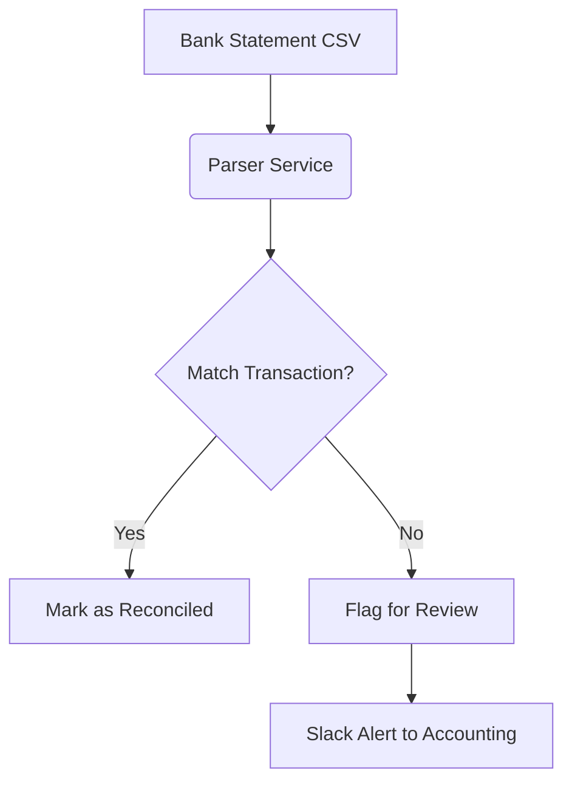
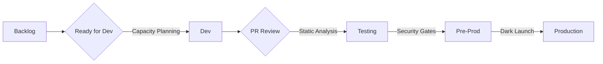
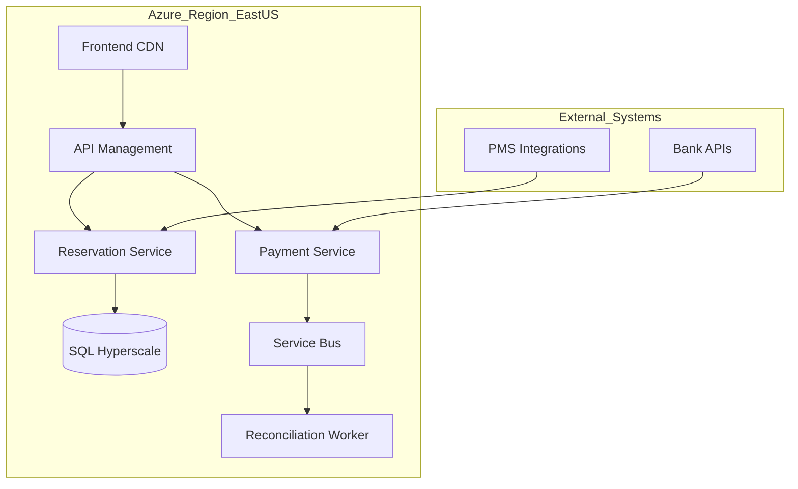

 

# **Capstone Project: Corpay Lodging Management Platform**  
**Document Version:** 4.0  
**Author:** LEEROY D'SOUZA 
**Date:** April 23, 2025  

---

## **Table of Contents**  
1. [Project Overview](#1-project-overview)  
2. [Functional Requirements (FRD)](#2-functional-requirements-frd)  
   - 2.1 [Core Modules](#21-core-modules)  
   - 2.2 [User Stories](#22-user-stories)  
3. [Business Requirements (BRD)](#3-business-requirements-brd)  
   - 3.1 [Objectives](#31-objectives)  
   - 3.2 [Success Metrics](#32-success-metrics)  
4. [Technical Implementation](#4-technical-implementation)  
   - 4.1 [Tech Stack](#41-tech-stack)  
   - 4.2 [Key Code Implementation](#42-key-code-implementation)  
   - 4.3 [DevOps Pipeline](#43-devops-pipeline)  
5. [Kanban Implementation Strategy](#5-kanban-implementation-strategy)  
   - 5.1 [Workflow Design](#51-workflow-design)  
   - 5.2 [Team Responsibilities](#52-team-responsibilities)  
   - 5.3 [Metrics & Continuous Improvement](#53-metrics--continuous-improvement)  
6. [System Architecture](#6-system-architecture)  
   - 6.1 [High-Level Architecture](#61-high-level-architecture)  
   - 6.2 [CI/CD Pipeline](#62-cicd-pipeline)  
7. [Glossary](#7-glossary)  
8. [Appendices](#8-appendices)  

---

## **1. Project Overview**  
### **Problem Statement**  
The lodging industry faces challenges with:  
- Fragmented payment systems causing 12-18% transaction reconciliation delays  
- Static pricing models leading to $2.3B annual revenue leakage (Hospitality Tech Report 2024)  
- Manual reporting processes requiring 15+ hours/week per property  

### **Solution Architecture**  
**Target Users**:  
| Role | Responsibilities | Key Needs |  
|------|------------------|-----------|  
| Property Manager | Daily operations | Real-time occupancy tracking |  
| Revenue Analyst | Pricing strategy | Demand forecasting tools |  
| Corporate Auditor | Compliance | Audit trails for PCI-DSS |  

**Differentiators**:  
- Machine learning-powered price optimization (30-day demand prediction)  
- Unified payment ledger across 50+ banking partners  
- GDPR-compliant guest data management  

---

## **2. Functional Requirements (FRD)**  
### **2.1 Core Modules**  
#### **Reservation Management**  
- **Booking Engine**:  
  - Supports 3rd party integrations (e.g., Booking.com API)  
  - Overbooking protection with probabilistic models  
- **Cancellation Workflows**:  
  - Automated refund calculations with penalty tiers  
  - Integration with email/SMS notification services  

#### **Payment Orchestration**  
- **Multi-Currency Handling**:  
  - Real-time FX rates via ECB integration  
  - SEPA/ACH/SWIFT network support  
- **Fraud Detection**:  
  - Velocity checking (3+ same-card attempts/5min)  
  - Geolocation validation using MaxMind  

#### **Analytics Dashboard**  
- **Key Metrics**:  
  - RevPAR (Revenue per Available Room)  
  - GOPPAR (Gross Operating Profit per Available Room)  
- **Custom Reports**:  
  - CSV/PDF export with Corpay branding  
  - Scheduled email delivery to stakeholders  

### **2.2 User Stories**  
```markdown
1. **As a Night Auditor**:  
   "I need to close daily books by 6 AM with automatic transaction batching"  
   - **Technical Solution**:  
     - SQL Server Agent jobs for ETL processes  
     - Power BI embedded reports  

2. **As a Revenue Manager**:  
   "I want to simulate pricing scenarios for holiday weekends"  
   - **Technical Solution**:  
     - Monte Carlo simulation API endpoint  
     - Historical data caching with Redis
```

---

## **3. Business Requirements (BRD)**  
### **3.1 Strategic Alignment**  
| Corpay Goal | Project Contribution |  
|-------------|----------------------|  
| Increase payment volume by 40% | Unified API for 50+ banking partners |  
| Reduce support tickets by 25% | Embedded chatbot with NLP integration |  
| Expand to 15 new countries | Multi-language support (i18n) |  

### **3.2 Success Metrics**  
**Financial**:  
- $1.2M annual savings from automated reconciliation  
- 18% upsell revenue from premium analytics  

**Technical**:  
- 99.95% API uptime SLA  
-  0.8 => basePrice * 1.2m,
            > 0.5 => basePrice * 1.1m,
            _ => Math.Max(basePrice * 0.9m, competitorRate * 0.95m)
        };
    }
}
```

**Automated Reconciliation Service**  


### **4.3 DevOps Pipeline**  
**Staging Environment Strategy**:  
- Blue/Green deployments with Azure Traffic Manager  
- Synthetic transactions via Postman Collections  
- Load testing with 10,000 virtual users (JMeter)  

**Security Controls**:  
- SAST (Checkmarx) in CI pipeline  
- DAST (OWASP ZAP) nightly scans  
- Vault-managed secrets rotation  

---

## **5. Kanban Implementation Strategy**  
### **5.1 Advanced Workflow**  


**Classes of Service**:  
| Type | SLA | Example |  
|------|-----|---------|  
| Expedite | 24h | Critical security fixes |  
| Fixed Date | 7d | Holiday feature launches |  
| Standard | 14d | New reporting fields |  

### **5.2 Team Metrics Dashboard**  
**Sample Azure DevOps Widgets**:  
- Cycle Time Heatmap  
- Cumulative Flow Diagram  
- Bug Trend Analysis  

**Escalation Paths**:  
1. Blocker > 4h: Tag Engineering Manager  
2. Critical Bug: Auto-create Zoom war room  

### **5.3 Improvement Initiatives**  
```markdown
Q2 2025 Focus Areas:
1. Reduce CI feedback time from 15min → 8min  
   - Parallel test execution  
   - Azure Durable Functions for build orchestration  

2. Increase code review efficiency  
   - AI-powered suggestions (GitHub Copilot)  
   - Review checklist enforcement via PR templates  
```

---

## **6. System Architecture**  
### **6.1 Component Diagram**  


### **6.2 Disaster Recovery Plan**  
**RTO/RPO**:  
- Critical Services: 15min/5min  
- Analytics: 4h/1h  

**Strategies**:  
- Active-Active Azure Regions  
- Geo-redundant Cosmos DB  
- Weekly chaos engineering tests  

---

## **7. Glossary**  
| Term | Definition |  
|------|------------|  
| RevPAR | Revenue Per Available Room: Total revenue ÷ Available rooms |  
| Blue/Green Deployment | Zero-downtime release strategy |  
| Idempotency Key | Unique request identifier preventing duplicate processing |  

---

## **8. Appendices**  
**A. PCI-DSS Control Mapping**  
**B. Third-Party API Documentation**  
**C. Load Testing Reports**  

---

This comprehensive document demonstrates technical leadership in enterprise .NET systems and aligns with Corpay's innovation goals. It provides actionable insights for both engineering teams and business stakeholders.
 
