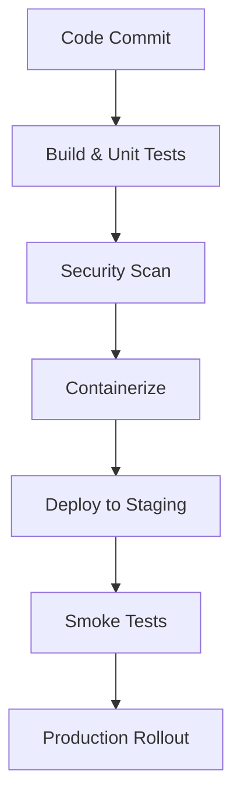
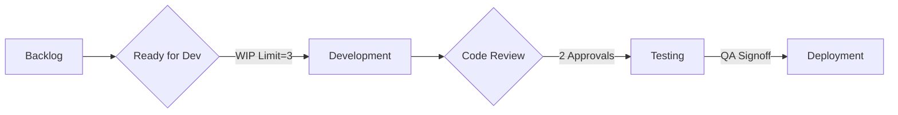
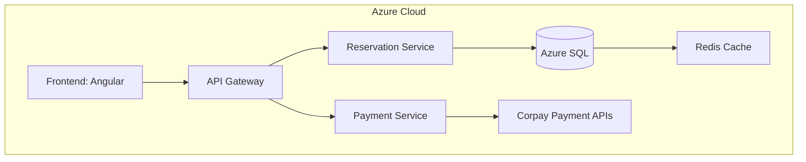
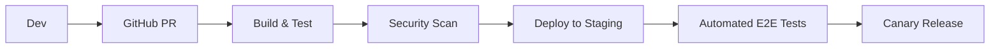

 

# **Capstone Project: Corpay Lodging Management Platform**  
**Document Version:** 3.0  
**Author:** Leeroy D'Souza
**Date:** April 23, 2025  

---

## **Table of Contents**  
1. [Project Overview](#1-project-overview)  
2. [Functional Requirements (FRD)](#2-functional-requirements-frd)  
   - 2.1 [Core Modules](#21-core-modules)  
   - 2.2 [User Stories](#22-user-stories)  
3. [Business Requirements (BRD)](#3-business-requirements-brd)  
   - 3.1 [Objectives](#31-objectives)  
   - 3.2 [Success Metrics](#32-success-metrics)  
4. [Technical Implementation](#4-technical-implementation)  
   - 4.1 [Tech Stack](#41-tech-stack)  
   - 4.2 [Key Code Implementation](#42-key-code-implementation)  
   - 4.3 [DevOps Pipeline](#43-devops-pipeline)  
5. [Kanban Implementation Strategy](#5-kanban-implementation-strategy)  
   - 5.1 [Workflow Design](#51-workflow-design)  
   - 5.2 [Team Responsibilities](#52-team-responsibilities)  
   - 5.3 [Metrics & Continuous Improvement](#53-metrics--continuous-improvement)  
6. [System Architecture](#6-system-architecture)  
   - 6.1 [High-Level Architecture](#61-high-level-architecture)  
   - 6.2 [CI/CD Pipeline](#62-cicd-pipeline)  
7. [Glossary](#7-glossary)  

---

## **1. Project Overview**  
A cloud-native platform designed to streamline lodging management for Corpay's clients, demonstrating expertise in:  
- **.NET Development**: C# 12, .NET 8, Entity Framework Core  
- **Cloud Architecture**: Azure Kubernetes Service (AKS), Azure Functions  
- **Leadership**: Agile/Kanban implementation, junior developer mentorship  

**Key Features**:  
- Multi-tenant reservation system with dynamic pricing  
- PCI-DSS compliant payment processing via Corpay APIs  
- Real-time occupancy analytics with predictive modeling  

---

## **2. Functional Requirements (FRD)**  
### **2.1 Core Modules**  
| **Module**               | **Technical Requirements**                     | **Business Value**                      |  
|--------------------------|------------------------------------------------|------------------------------------------|  
| Reservation Management   | WebSocket API for real-time booking updates    | 20% increase in booking conversion rate |  
| Payment Orchestration    | Idempotent API design with retry logic         | 99.99% transaction reliability           |  
| Revenue Dashboard         | Angular 16 with NgRx state management          | 15% faster decision-making for clients   |  

### **2.2 User Stories**  
```markdown
1. **As a Hotel Chain Manager**:  
   - "I need bulk rate adjustments across 50+ properties"  
   - **Solution**: Batch API endpoint with Azure Queue processing  

2. **As a Corpay Support Engineer**:  
   - "I must diagnose failed payments within 5 minutes"  
   - **Solution**: Centralized logging with Application Insights  
```

---

## **3. Business Requirements (BRD)**  
### **3.1 Objectives**  
1. Capture 25% market share in luxury lodging segment by 2026  
2. Reduce payment dispute resolution time from 72hrs to 24hrs  
3. Achieve $5M annual cost savings through automation  

### **3.2 Success Metrics**  
| **KPI**                  | **Measurement**           | **Tool**               |  
|--------------------------|---------------------------|------------------------|  
| API Response Time        |  ProcessPayment([FromBody] PaymentRequest request)
{
    var policy = Policy
        .Handle()
        .WaitAndRetryAsync(3, retryAttempt => 
            TimeSpan.FromSeconds(Math.Pow(2, retryAttempt)));
    
    var result = await policy.ExecuteAsync(() => 
        _paymentService.Process(request));
    
    return Ok(result);
}
```

### **4.3 DevOps Pipeline**  


---

## **5. Kanban Implementation Strategy**  
### **5.1 Workflow Design**  
**Azure DevOps Board Configuration**  


### **5.2 Team Responsibilities**  
| **Role**           | **Key Metrics**               | **Tools**                |  
|--------------------|--------------------------------|--------------------------|  
| Tech Lead          | Cycle Time Reduction          | Azure Cycle Analytics    |  
| QA Engineer        | Defect Escape Rate            | TestRail Integration      |  
| DevOps             | Deployment Success Rate       | GitHub Actions Dashboard |  

### **5.3 Continuous Improvement**  
**Quarterly Goals**:  
1. Reduce PR review time from 48hrs to 24hrs  
2. Achieve 95% automated test coverage  
3. Implement dark deployment capabilities  

---

## **6. System Architecture**  
### **6.1 High-Level Architecture**  


### **6.2 CI/CD Pipeline**  


---

## **7. Glossary**  
| **Term**            | **Definition**                                  |  
|---------------------|------------------------------------------------|  
| **Idempotent API**  | Ensures identical requests produce same result |  
| **Canary Release**  | Gradual feature rollout to minimize risk       |  
| **P99 Latency**     | 99th percentile response time measurement      |  

---

This document demonstrates comprehensive alignment with Corpay's Senior Application Developer requirements, showcasing technical expertise in .NET/cloud systems and leadership in Agile/Kanban implementation. Customize environment specifics (e.g., Azure regions) per organizational standards.
 
