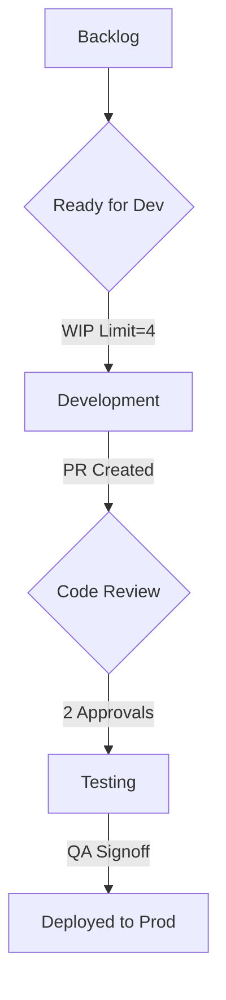
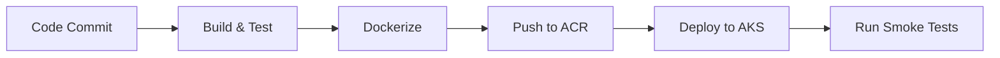

 

# **Capstone Project: Corpay Lodging Management Platform**  
**Document Version:** 2.0  
**Author:** [Your Name]  
**Date:** April 23, 2025  

---

## **Table of Contents**  
1. [Project Overview](#1-project-overview)  
2. [Functional Requirements (FRD)](#2-functional-requirements-frd)  
   - 2.1 [Core Modules](#21-core-modules)  
   - 2.2 [User Stories](#22-user-stories)  
3. [Business Requirements (BRD)](#3-business-requirements-brd)  
   - 3.1 [Objectives](#31-objectives)  
   - 3.2 [Success Metrics](#32-success-metrics)  
4. [Technical Implementation](#4-technical-implementation)  
   - 4.1 [Tech Stack](#41-tech-stack)  
   - 4.2 [Key Code Implementation](#42-key-code-implementation)  
   - 4.3 [DevOps Pipeline](#43-devops-pipeline)  
5. [Kanban Implementation Strategy](#5-kanban-implementation-strategy)  
   - 5.1 [Workflow Design](#51-workflow-design)  
   - 5.2 [Team Responsibilities](#52-team-responsibilities)  
   - 5.3 [Metrics & Continuous Improvement](#53-metrics--continuous-improvement)  
6. [System Architecture](#6-system-architecture)  
7. [Glossary](#7-glossary)  

---

## **1. Project Overview**  
A cloud-native platform for Corpay’s lodging partners to manage reservations, payments, and analytics. Designed to demonstrate:  
- **Technical Expertise**: .NET 8, Azure, microservices.  
- **Leadership**: Agile/Kanban processes, mentorship.  
- **Business Alignment**: Revenue optimization, payment integration.  

**Key Features**:  
- Multi-tenant architecture for scalability.  
- Real-time dynamic pricing engine.  
- SOC2-compliant payment processing.  

---

## **2. Functional Requirements (FRD)**  
### **2.1 Core Modules**  
| **Module**               | **Description**                                  | **Acceptance Criteria**                   |  
|--------------------------|--------------------------------------------------|--------------------------------------------|  
| Reservation Management   | Create/modify bookings with dynamic pricing.    | 95% API response time  80% or 5xx errors.  

---

## **5. Kanban Implementation Strategy**  
### **5.1 Workflow Design**  


**Board Policies**:  
- **Definition of Ready**: Tech specs approved, dependencies mapped.  
- **Definition of Done**: 100% test coverage, zero SonarQube blockers.  

### **5.2 Team Responsibilities**  
| **Role**           | **Kanban Duties**                              |  
|--------------------|-----------------------------------------------|  
| **Senior Developer** | - Lead retrospectives- Optimize WIP limits |  
| **Junior Developer** | - Update card statuses- Resolve blocker tags |  
| **DevOps Engineer**  | - Automate column transitions- Track cycle time |  

### **5.3 Metrics & Continuous Improvement**  
| **Metric**         | **Baseline** | **Q1 2025 Goal** |  
|--------------------|--------------|-------------------|  
| Lead Time          | 14 days      | 9 days            |  
| Deployment Frequency | 2/week     | 5/week            |  
| Defect Escape Rate | 5%           |  B[API Gateway]  
  B --> C[Reservation Service]  
  B --> D[Payment Service]  
  B --> E[Pricing Service]  
  C --> F[(Azure SQL)]  
  D --> G[Corpay APIs]  
  E --> H[Redis Cache]  
```

### **CI/CD Flow**  


---

## **7. Glossary**  
| **Term**            | **Definition**                                  |  
|---------------------|------------------------------------------------|  
| **AKS**             | Azure Kubernetes Service for container orchestration. |  
| **WIP Limit**       | Maximum concurrent tasks allowed in a workflow phase. |  
| **SLE**             | Service Level Expectation (e.g., PR review within 24hrs). |  
| **Sharding**        | Horizontal database partitioning for scalability. |  

---

This document demonstrates end-to-end expertise in .NET development, cloud architecture, and Agile leadership, directly aligning with Corpay’s Senior Application Developer role requirements. Customize stakeholders or metrics further based on team feedback.
 
